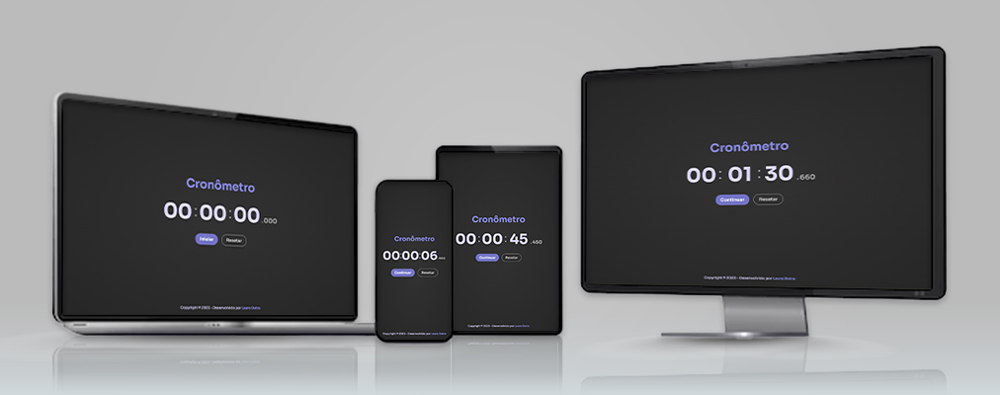

<h1>CRONÔMETRO</h1>

## 📝 Sobre

O projeto Cronômetro apresenta um contador de tempo que inclui horas, minutos, segundos e milisegundos. O design do site foi planejado tanto para dispositivos móveis quanto para desktops, resultando em uma combinação de cores agradável aos olhos do usuário.

## ⚙ Funcionalidades

Para iniciar a cronometragem, aperte o botão "Iniciar" e, caso necessário, aperte "Pausar" para congelar a contagem. O botão "Continuar" retoma a contagem exatamente de quando foi pausada, e o botão "Resetar" zera o cronômetro.

## 🤝🏻 Agradecimentos

Agradeço ao <a href="https://www.github.com/rodolfomori">Rodolfo Mori</a> por dar o desafio de criar um cronômetro sozinho, apenas com o aprendizado das aulas e, claro, um pouco de pesquisa e leitura de documentação. 

## 🖥 Tecnologias

Este projeto foi desenvolvido com HTML, CSS e JavaScript.
